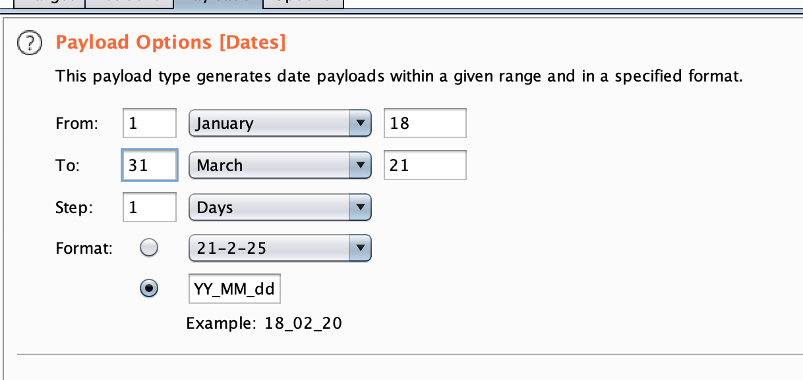
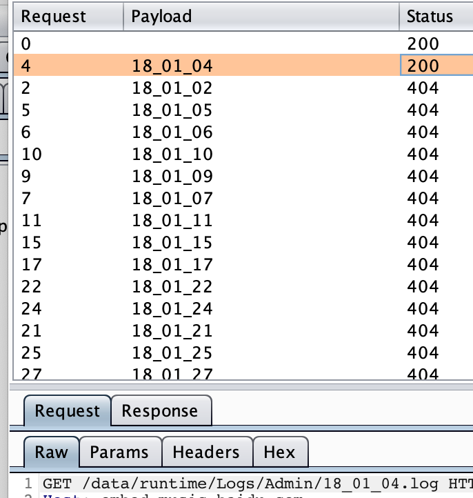

# Burp 技巧

## burp加载配置文件

1.解决burp重新加载，插件不启动的问题。

>进入%APPDATA%\BurpSuite\（*nix系统的目录为~/.BurpSuite/），修改UserConfigPro.json文件，全局替换"loaded":false为"loaded":true（注意修改的时候BurpSuite应该为关闭状态），然后重新打开，BurpSuite插件就会重新加载了。

## burp 爆破技巧-时间戳

效果如下:

