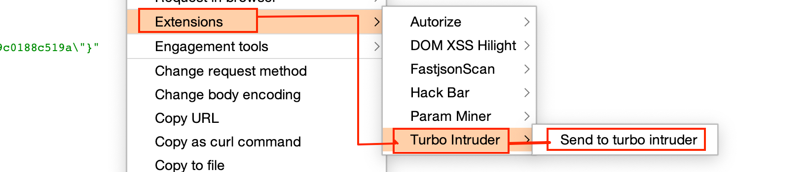
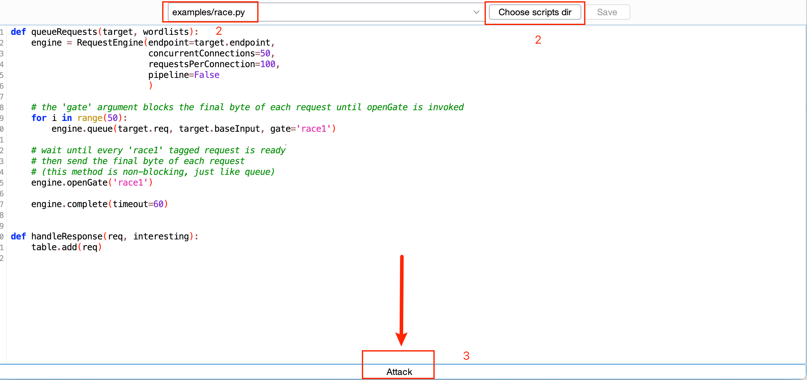

# 并发漏洞

利用: burpsuite Bapp Store 下载    turbo-intruder 

`git clone https://github.com/portswigger/turbo-intruder  `

并发脚本:

`turbo-intruder/resources/examples/race.py`

请求包右键,打开Turbo Intruder

测试Start

可以根据脚本，调整并发的速度。

